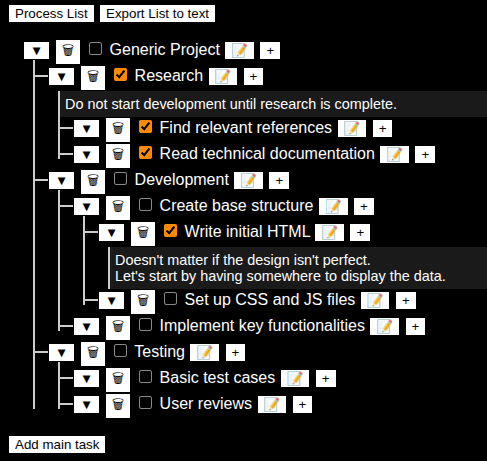

# Simple TODO List

This project is a lightweight web application for managing task lists (checklists) directly in the browser. It allows creating multiple task lists where each task can have nested subtasks infinitely. It's perfect for organizing activities, pending tasks, or any kind of work requiring structured tracking.

## Main Features

- **Add and remove tasks:** Easily create new tasks or delete them when they're no longer needed.
- **Unlimited subtasks:** Each task can contain subtasks, which in turn can have their own subtasks, with no depth limit.
- **Task descriptions:** Each task has the option to add a detailed description, useful for providing context without needing an additional task.
- **Simple interface:** Everything is managed from a single HTML page, without needing to reload or navigate to other pages.
- **No backend:** The application runs entirely on the frontend. It doesn't make HTTP requests, use sockets, or require external servers.
- **List export:** Lists can be exported as plain text and inserted into the text area for copying and pasting wherever needed (e.g., in a text editor).

## Technologies Used

- HTML
- CSS
- JavaScript (runs entirely in the browser)

## Usage

- Write or paste your task list into **the text area**.
- Click **Process List button** to create the checklist from the text.
- Tasks can be *expanded* or *collapsed* using the **▼ / ▶ toggle button**, allowing you to focus on relevant items.
- Tasks also have a **🗑 button** to remove them, including all their subtasks.
- Each task has a **📝 button** to open a modal where you can add a description.
- You can also use the **Add main task** button to create a top-level parent task that can only have subtasks, without using **Generate List**.
- Click **Export List to text** to generate the plain-text version of the list.
- Descriptions are stored and exported in the `[Description: ...]` format, preserving line breaks `\n` for readability.

## Example List Format

The application uses a simple text format to represent tasks and subtasks. This same format can be used both for input and exporting lists. Completed tasks use `[x]`, and pending tasks use `[ ]`. Indentation with spaces determines hierarchy (tasks and subtasks). Descriptions are optional and are stored alongside the task.

```text
[ ] Generic Project
    [x] Research [Description: Do not start development until research is complete.]
        [x] Find relevant references
        [x] Read technical documentation
    [ ] Development
        [ ] Create base structure
            [x] Write initial HTML [Description: Doesn't matter if the design isn't perfect.\nLet's start by having somewhere to display the data.]
            [ ] Set up CSS and JS files
        [ ] Implement key functionalities
    [ ] Testing
        [ ] Basic test cases
        [ ] User reviews
```
The list above would like this:



---

This project is a classic example of a TODO list, designed to be simple, fast, and free of external dependencies.